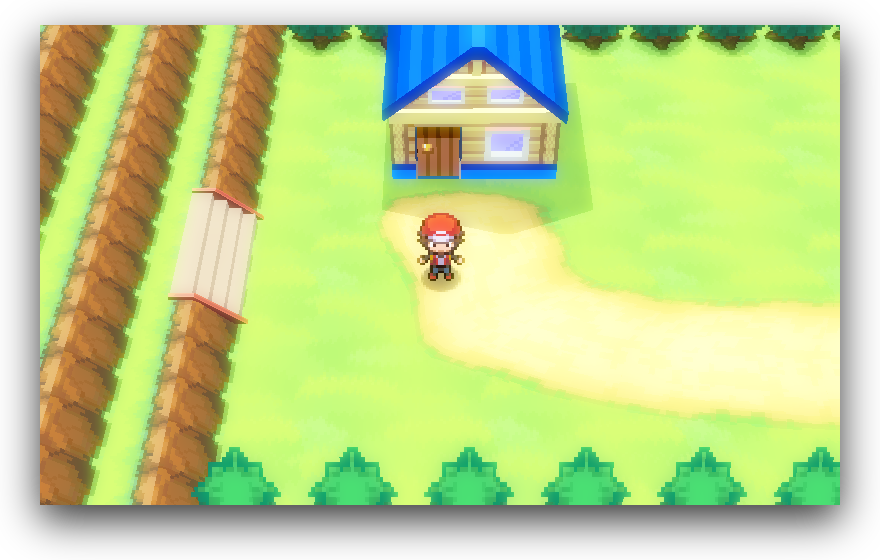
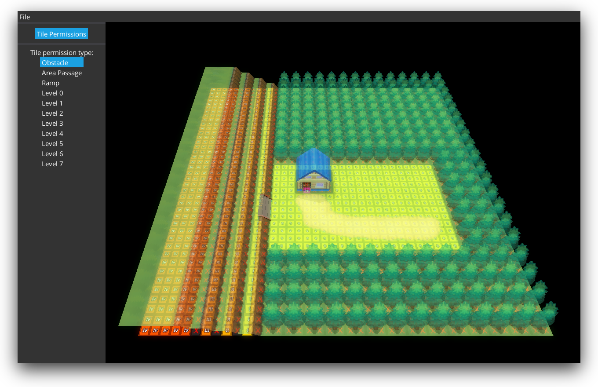

# Helix Engine

A 3D RPG engine inspired by early NDS Pokémon games, built with [libGDX].

**[In-game video (YouTube)](https://www.youtube.com/watch?v=8ep3P-z82zQ)**

## RETIREMENT NOTICE

The project has been retired in 2016.

## Screenshots

  

  

## Technology

* Java
* [libGDX] framework (engine core)
* [artemis-odb](https://github.com/junkdog/artemis-odb) Entity-Component-System framework (engine core)
* [VisUI](https://github.com/kotcrab/vis-ui) UI library (editor UI)

## Building

Use [libGDX developer's guide](https://libgdx.com/wiki/) as reference.

## Licensing

See the [COPYING](https://github.com/fauu/HelixEngine/blob/master/COPYING) file.

## Authors

See the [AUTHORS](https://github.com/fauu/HelixEngine/blob/master/AUTHORS) file.

[libGDX]: https://libgdx.com/
